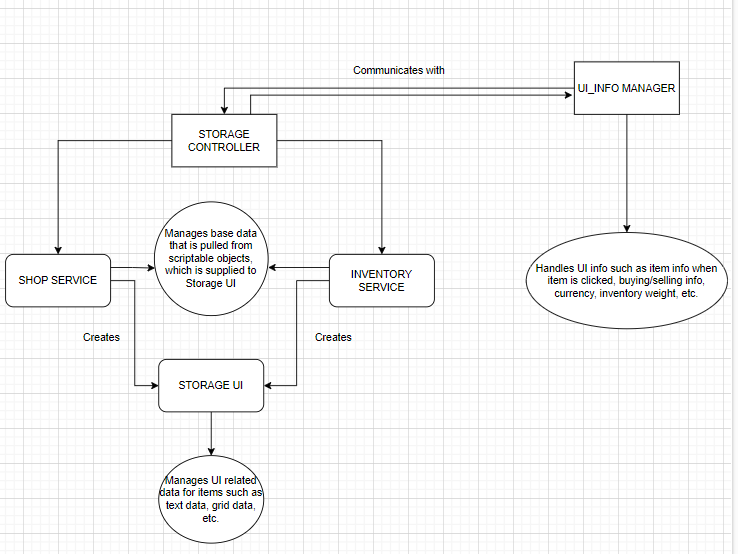

# InventorySystem
This is a repo I created for implementing an Inventory System in Unity C#.

Assets/Resources contains the Scriptable Object Instances of UI Items that are loaded before the scene starts. I have used Resources.Load() function to load the items in the shop. I also use the same folder to load items at runtime such as when the player needs to gather resources by selecting the "Gather Resources" button.

All the scripts are present in the Assets/Scripts folder.

Services Folder:
- Services folder contains the StorageController.cs script, which handles the creation of ShopService and InventoryService, as well has mouse click events(user input).
- ShopService.cs maintains data related to the items in the shop. It also handles other data such as the different UI panels for each filtered item type.
- InventoryService.cs does the same as ShopService except it contains other logic related to the amount of money the player owns as well as the weight of the Inventory.

UI folder:
- StorageUI.cs is a script that is dynamically instantiated as an object during runtime by both ShopService.cs and InventoryService.cs. This handles the data related to the UI of the items displayed.
- StorageUI.cs takes in a panel and a list of items to be created in it's constructor declaration. Using this data, it fills the respective UI panel with items.
- ShopService.cs actually creates 5 instances of the StorageUI.cs, each belonging to a particular item type.

- UI_InfoManager.cs handles all dynamic on-screen info. This can include the info panel that activates when the player selects an item, the panel activated for buying/selling an item, transaction status text and info related to currency that the player holds as well as the overall weight of the inventory. 

Design Patterns Used:
- Dependency Injection 
    - Used when I create StorageUI from ShopService and InventoryService.
    - Used when I create ShopService and InventoryService from StorageController

- Observer Pattern
    - Used to enable loosely-coupled interaction between UI_InfoManager and StorageController

Below is the Architecture Diagram:
